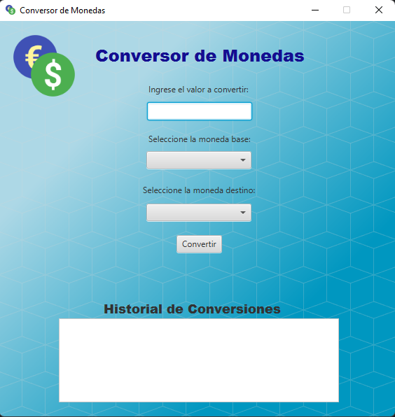
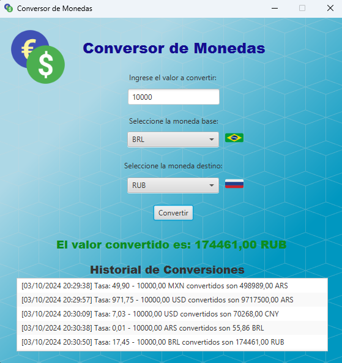
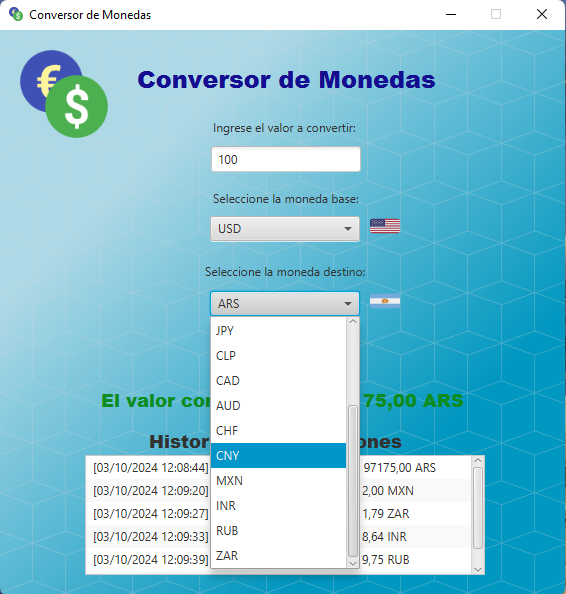

# Conversor de Monedas - JavaFX Application 🌍💸

Bienvenido al **Conversor de Monedas**. Esta aplicación gráfica, construida con **JavaFX** y utilizando la API de [ExchangeRate-API](https://www.exchangerate-api.com/), permite a los usuarios convertir entre diversas monedas internacionales de manera rápida y sencilla.
## 💡 Desafío Alura-ONE Java Challenge Conversor de Monedas 💡
Esta app forma parte del desafío de Alura del Conversor de Monedas con la solicitud a una API de tasas de cambio, manipular datos JSON, filtrar y mostrar las monedas de interés, por iniciativa propia decidí desarrollar una alternativa con interfaz gráfica en JavaFX.



## 🖥️ Características Principales
- **Conversión en Tiempo Real**: Utiliza tasas de cambio actualizadas en tiempo real, proporcionadas por la API, para convertir entre múltiples monedas.
- **Interfaz Intuitiva**: La interfaz gráfica es amigable y fácil de usar, permitiendo seleccionar las monedas de origen y destino con un par de clics.
- **Historial de Conversiones**: Un historial integrado que muestra las conversiones realizadas, permitiendo a los usuarios ver sus transacciones pasadas con marcas de tiempo precisas.
- **Soporte para Múltiples Monedas**: Actualmente, soporta las siguientes monedas:
  - 🇺🇸 USD - Dólar estadounidense
  - 🇪🇺 EUR - Euro
  - 🇬🇧 GBP - Libra esterlina
  - 🇯🇵 JPY - Yen japonés
  - 🇦🇷 ARS - Peso argentino
  - 🇧🇷 BRL - Real brasileño
  - 🇨🇱 CLP - Peso chileno
  - 🇨🇦 CAD - Dólar canadiense
  - 🇦🇺 AUD - Dólar australiano
  - 🇨🇭 CHF - Franco suizo
  - 🇨🇳 CNY - Yuan chino
  - 🇲🇽 MXN - Peso mexicano
  - 🇮🇳 INR - Rupia india
  - 🇷🇺 RUB - Rublo ruso
  - 🇿🇦 ZAR - Rand sudafricano
- **Marcas de Tiempo**: Cada conversión realizada es registrada con una marca de tiempo que muestra la fecha y hora exacta de la operación.
- **Icono Personalizado**: La ventana de la aplicación tiene un ícono propio que complementa la identidad visual de la app.
  
## 🖼️ Interfaz de Usuario

La aplicación presenta una interfaz clara y profesional:

- Un título grande que dice "**Conversor de Monedas**" con un estilo visual atractivo.
- Campos para ingresar el valor a convertir y seleccionar las monedas de base y destino.
- Botones desplegables (ComboBox) con banderas para ayudar a identificar visualmente las monedas seleccionadas.
- Un botón de "**Convertir**" que ejecuta la operación de cambio, mostrando el resultado en pantalla.
- Un área de **historial de conversiones** en la parte inferior, que registra cada operación de manera automática.




## 🚀 Cómo Ejecutar la Aplicación

### Requisitos:

- **Java 17** o superior.
- **Maven** (opcional, si usas Maven para manejar dependencias).

### Instrucciones:

1. Clona este repositorio en tu máquina local:

   ```bash
   git clone https://github.com/tuusuario/conversor-monedas-javafx.git
   ```
2. Navega al directorio del proyecto:
   ```bash
   cd conversor-monedas-javafx
   ```
3. Si usas Maven, puedes construir el proyecto con:

   ```bash
   mvn clean install
   ```
4. Ejecuta la aplicación:
   ```bash
   java -jar target/conversor-monedas-javafx.jar
   ```
O bien busca el archivo: **challenge-conversor-monedas-javafx.jar** en el directorio /out/artifactcs/challenge_conversor_monedas_javafx_jar/ luego bájalo a tu pc y ejecútalo con doble click.

¡Listo! La aplicación de conversión de monedas se abrirá en una ventana gráfica.
## 📦 Instalación
### API
Este proyecto usa la API de ExchangeRate-API.
> [!CAUTION]
> Se requiere una clave API válida para su funcionamiento.
> Agregar la clave API: Dentro de la clase Principal, reemplaza el valor de apiKey con tu clave personal obtenida de ExchangeRate-API.
   Es fácil obtenerla, solo necesitas tener una direccion de correo donde te la envían
   ```java
   String apiKey = "TU_CLAVE_API_AQUI";
   ```

### Prerrequisitos:
- Java 17 o superior
- Conexión a Internet para las consultas a la API
- IDE o editor de texto como IntelliJ IDEA, Eclipse o VSCode.
- Tener tu propia API_KEY de la API.

### Pasos:
1. Clonar el repositorio:
   ```bash
   git clone https://github.com/tuusuario/conversor-monedas-javafx.git
   ```
2. Importar el proyecto en tu IDE favorito.

3. Agregar la clave API: Dentro de la clase Principal, reemplaza el valor de apiKey con tu clave personal obtenida de ExchangeRate-API. Es fácil obtenerla, solo necesitas tener una direccion de correo donde te la envían
   ```java
   String apiKey = "TU_CLAVE_API_AQUI";
   ```
4. Ejecutar la aplicación: Ejecuta la clase Principal desde tu IDE para iniciar el programa.

## 📦 Estructura del Proyecto
Se utiliza el patrón de diseño Modelo Vista Controlador (MVC)
```bash

src/
│
└── main/
   ├── java/
   │   └── com/alura/challengeconversormonedasjavafx/
   │       ├── controlador/
   │       │   └── ConversorDeMonedaControlador.java
   │       ├── modelo/
   │       │   └── Moneda.java
   │       ├── servicio/
   │       │   └── APIServicio.java
   │       ├── EjecutarApp.java
   │       └── ConversorDeMonedaApp.java
   │
   ├── resources/
   │   ├── assets/
   │   │   └── ConversorMoneda.png
   │   └── vista.fxml
   └── styles/
       └── styles.css
```
## 🛠️ Tecnologías Utilizadas
- JavaFX: Framework para la construcción de interfaces gráficas de usuario.
- ExchangeRate-API: Para obtener tasas de cambio en tiempo real.
- Java 17: Lenguaje de programación principal.
- Maven: Manejo de dependencias y construcción del proyecto.
- Gson: Procesamiento de respuestas JSON desde la API.
- HttpClient: Para realizar solicitudes HTTP a la API de tasas de cambio.
- HttpRequest: Para crear y configurar solicitudes HTTP que serán enviadas a un servidor.
- HttpResponse: Para representar las respuestas recibidas después de enviar una solicitud HTTP. Estas dos ultimas se integran con HttpClient para manejar solicitudes y respuestas en interacciones con una API.
## 📜 Licencia y Contribuciones
Siéntete libre de utilizarlo, modificarlo y distribuirlo como desees.

¡Gracias por usar el Conversor de Monedas, las contribuciones son bienvenidas! Si tienes alguna pregunta o sugerencia envíame un mensaje.

Usa el código con precaución. 🚀
## 👨‍💻Autor: Alberto Vallecillo
<a href="https://linkedin.com/in/alberto-vallecillo" target="_blank">

</a>
<a href="https://github.com/Alb3rtoGitHub" target="_blank">

</a>
